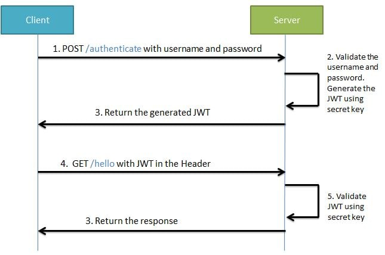
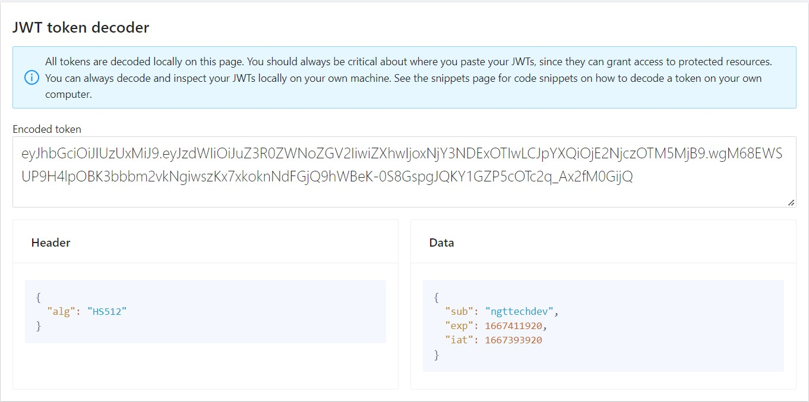

# Springboot JWT Demo without JPA 

We will be developing the project in stages
- Develop a Spring Boot Application to expose a Simple REST GET API with mapping /hello.
- Configure Spring Security for JWT. Expose REST POST API with mapping */authenticate* using which User will get a valid JSON Web Token. And then allow the user access to the api */hello* only if it has a valid token

    

## Develop a Spring Boot Application to expose a GET REST API
### Maven Project will be as follows-

## Compile and the run the **SpringBootHelloWorldApplication.java** as a Java application.
### Go to *localhost:8080/hello*

## Spring Security and JWT Configuration
### We will be configuring Spring Security and JWT for performing 2 operations-
- Generating JWT - Expose a POST API with mapping /authenticate. On passing correct username and password it will generate a JSON Web Token(JWT)
- Validating JWT - If user tries to access GET API with mapping /hello. It will allow access only if request has a valid JSON Web Token(JWT)

### Maven Project will be as follows-

## The sequence flow for these operations will be as follows-
### **Generating JWT**

### **Validating JWT**

- Define the application.properties. The secret key is combined with the header and the payload to create a unique hash. We are only able to verify this hash if you have the secret key.

            jwt.secret=springbootjwtdemongttechdevsgsdfbdghfgjfhjfhgfhfjukiurear65645743dvsfdhgfhdgffdsgdfgsdjhisdhgofhgodfihbodibhodfibhdfojsdcgidsuusdhfodsghwgaopeghfoihbdofhdoihjbdfbjdfihbodfjbdfhbjodifjdifhjodsifhbjdso

- JwtTokenUtil

    The JwtTokenUtil is responsible for performing JWT operations like creation and validation.It makes use of the io.jsonwebtoken.Jwts for achieving this. 
    
    Code : [JwtTokenUtil.java](./src/main/java/com/ngttech/demo/config/JwtTokenUtil.java "JwtTokenUtil.java").

- JWTUserDetailsService 

    JWTUserDetailsService implements the Spring Security UserDetailsService interface. It overrides the loadUserByUsername for fetching user details from the database using the username. The Spring Security Authentication Manager calls this method for getting the user details from the database when authenticating the user details provided by the user. Here we are getting the user details from a hardcoded User List.

    Code : [JWTUserDetailsService.java](./src/main/java/com/ngttech/demo/service/JwtUserDetailsService.java "JWTUserDetailsService.java").

- JwtAuthenticationController

    Expose a POST API */authenticate* using the JwtAuthenticationController. The POST API gets username and password in the body- Using Spring Authentication Manager we authenticate the username and password.If the credentials are valid, a JWT token is created using the JWTTokenUtil and provided to the client.

    Code : [JwtAuthenticationController.java](./src/main/java/com/ngttech/demo/controller/JwtAuthenticationController.java "JwtAuthenticationController.java").

- JwtRequest

    This class is required for storing the username and password we recieve from the client.

    Code : [JwtRequest.java](./src/main/java/com/ngttech/demo/model/JwtRequest.java "JwtRequest.java").

- JwtResponse

    This is class is required for creating a response containing the JWT to be returned to the user.

    Code : [JwtResponse.java](./src/main/java/com/ngttech/demo/model/JwtResponse.java "JwtResponse.java").

- JwtRequestFilter

    The JwtRequestFilter extends the Spring Web Filter OncePerRequestFilter class. For any incoming request this Filter class gets executed. It checks if the request has a valid JWT token. If it has a valid JWT Token then it sets the Authentication in the context, to specify that the current user is authenticated.

    Code : [JwtRequestFilter.java](./src/main/java/com/ngttech/demo/config/JwtRequestFilter.java "JwtRequestFilter.java").

- JwtAuthenticationEntryPoint

    This class will extend Spring's AuthenticationEntryPoint class and override its method commence. It rejects every unauthenticated request and send error code 401

    Code : [JwtAuthenticationEntryPoint.java](./src/main/java/com/ngttech/demo/config/JwtAuthenticationEntryPoint.java "JwtAuthenticationEntryPoint.java").

- WebSecurityConfig

    This class extends the WebSecurityConfigurerAdapter is a convenience class that allows customization to both WebSecurity and HttpSecurity.

    Code : [WebSecurityConfig.java](./src/main/java/com/ngttech/demo/config/WebSecurityConfig.java "WebSecurityConfig.java").

## Start the Spring Boot Application

- Generate a JSON Web Token -

    Create a POST request with url localhost:8080/authenticate. Body should have valid username and password. In our case username is *ngttechdev* and password is *password*.

    

- Decode JWT token -

    Open **[jwt-decoder](https://jwt-decoder.com/)** and paste generated JWT token as below to see the data .

    

- Validate the JSON Web Token

    Try accessing the url localhost:8080/hello using the above generated token in the header as follows

    

- Validate endpoint without JSON Web Token

    Try accessing the url localhost:8080/hello without generated JWT token

    

