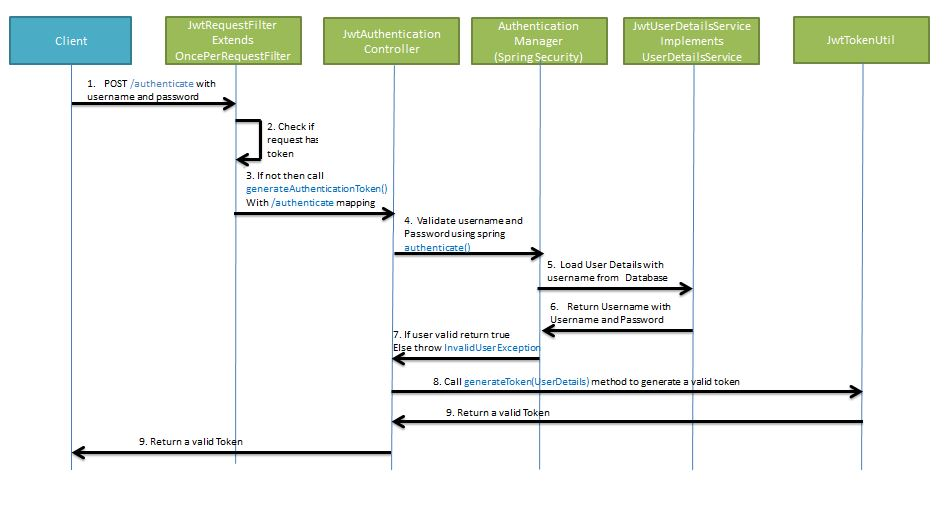

# spring-boot-jwt-demo

We will be developing the project in stages
- Develop a Spring Boot Application to expose a Simple REST GET API with mapping /hello.
- Configure Spring Security for JWT. Expose REST POST API with mapping */authenticate* using which User will get a valid JSON Web Token. And then allow the user access to the api */hello* only if it has a valid token

## Develop a Spring Boot Application to expose a GET REST API
### Maven Project will be as follows-

## Compile and the run the **SpringBootHelloWorldApplication.java** as a Java application.
### Go to *localhost:8080/hello*

## Spring Security and JWT Configuration
### We will be configuring Spring Security and JWT for performing 2 operations-
- Generating JWT - Expose a POST API with mapping /authenticate. On passing correct username and password it will generate a JSON Web Token(JWT)
- Validating JWT - If user tries to access GET API with mapping /hello. It will allow access only if request has a valid JSON Web Token(JWT)

### Maven Project will be as follows-

## The sequence flow for these operations will be as follows-
### **Generating JWT**

